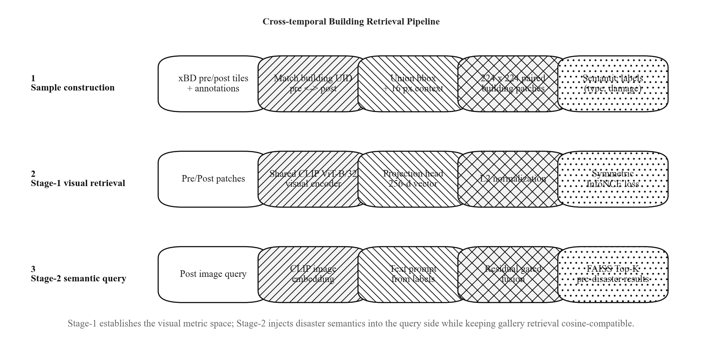
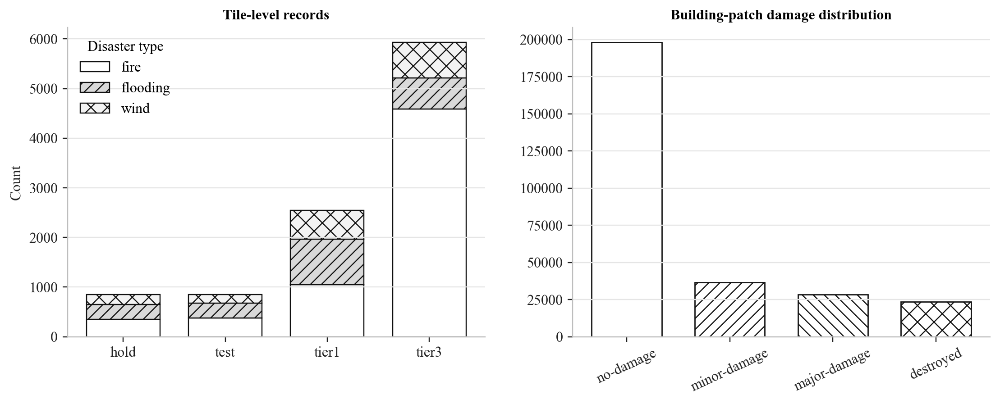
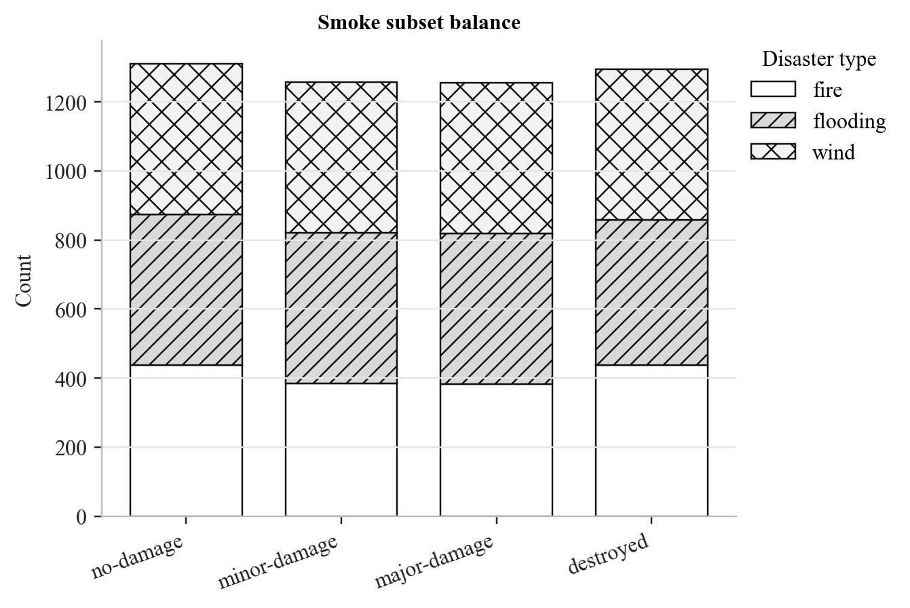
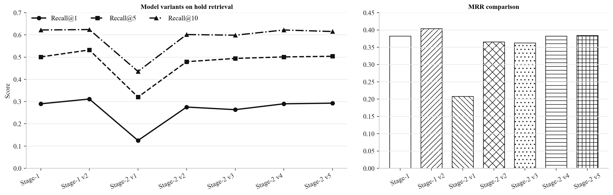
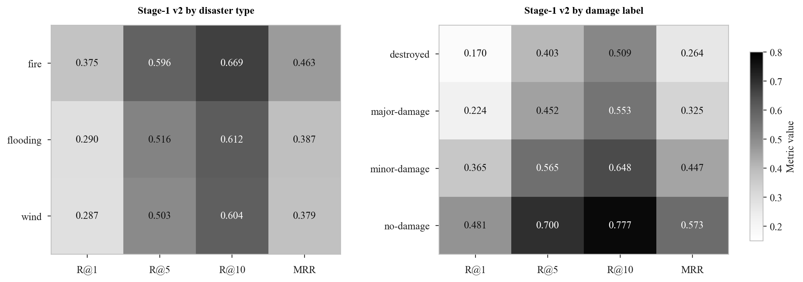
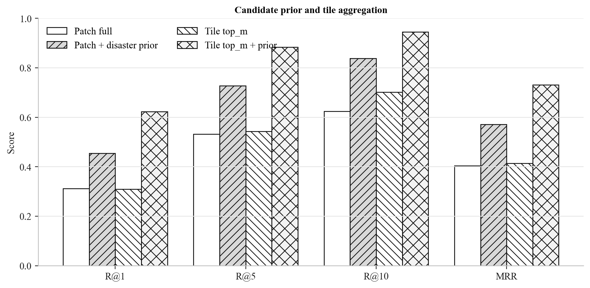
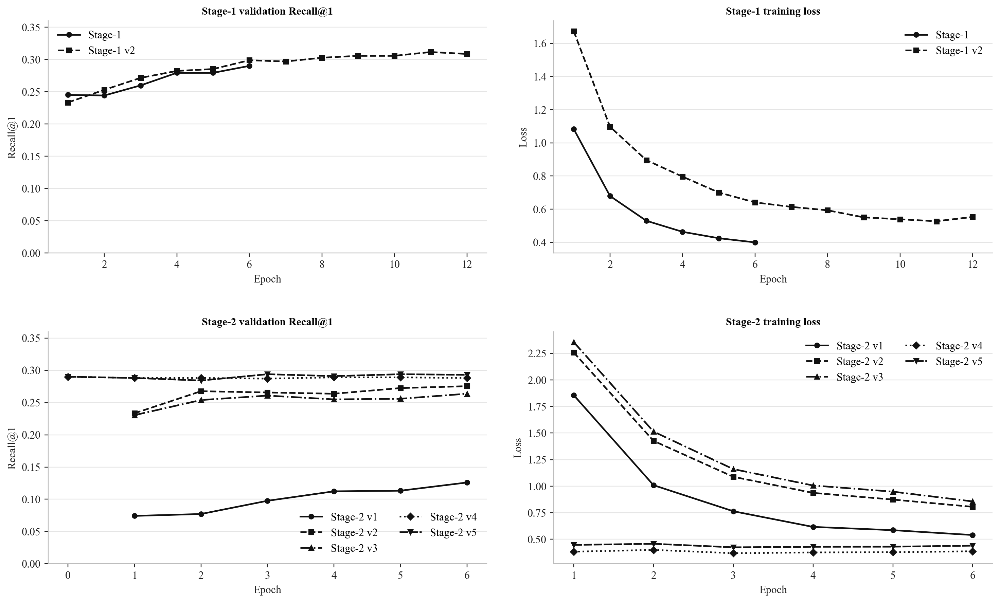

# 跨时相灾害遥感建筑检索算法设计

本文档基于 `scripts/` 中的实验脚本、`src/` 中的模型与检索实现、`outputs/` 中的实际评估结果，以及 `docs/` 中已有系统说明整理。`Algorithm Design.txt` 仅作为章节结构参考；与参考稿不同的是，当前应用服务 `src/api/retrieval_service.py` 默认部署 `clip_visual_baseline_smoke_stage1_v2.pt`，Stage-2 语义模型是保留的语义增强实验链路。

## 1. Algorithm Overview

系统解决的是建筑级跨时相遥感图像检索问题：给定灾后建筑图像或整幅灾后瓦片，系统需要在灾前图库中检索同一建筑或同一空间区域的灾前候选。整体 pipeline 如图 1 所示，核心思想是先构造严格对齐的灾前/灾后建筑 patch 对，再学习一个共享的视觉度量空间；语义增强阶段进一步将灾害类型与损毁标签注入查询侧表征。



**Figure 1.** Cross-temporal building retrieval pipeline. Stage-1 学习稳定视觉检索空间；Stage-2 在查询侧融合灾害语义；线上系统使用离线灾前特征库和 FAISS/cosine 检索返回 Top-K 结果。

形式化地，令灾后查询为 \(q_{post}\)，灾前图库为 \(G_{pre}=\{g_i\}_{i=1}^{N}\)。模型学习编码器 \(f(\cdot)\)，并以余弦相似度排序：

\[
s(q_{post}, g_i)=
\frac{f(q_{post})^\top f(g_i)}
{\|f(q_{post})\|_2\|f(g_i)\|_2},
\qquad
R_K=\operatorname{TopK}_{g_i\in G_{pre}} s(q_{post}, g_i).
\]

训练目标是让同一建筑的灾前/灾后 patch 在特征空间中接近，同时把同一 batch 内其他建筑作为负样本拉开。

## 2. Dataset and Sample Construction

原始数据来自 xBD 灾害遥感数据集。`scripts/build_metadata.py` 首先筛选 `fire`、`flooding`、`wind` 三类灾害，构建 10,178 条 tile 级记录；随后 `scripts/build_building_patches.py` 根据建筑标注中的 `uid` 匹配同一建筑实例，并用灾前 bbox 与灾后 bbox 的并集作为裁剪区域，额外扩展 16 像素上下文，最终将灾前、灾后 patch 统一 resize/pad 到 \(224\times224\)。未启用 `--include-unclassified` 时，`un-classified` 损毁类别会被过滤。

完整建筑级数据包含 286,791 个 pre/post patch 对，覆盖 6,306 个 tile；开发闭环使用 `scripts/build_smoke_subset.py` 构建 smoke subset，共 5,120 个样本，其中 tier3 训练 4,096 个、hold 验证 1,024 个。采样按 `disaster_type + damage_label` 轮转，并限制每个 tile 的采样数，以降低类别与空间区域不均衡。



**Figure 2.** 数据构造统计。左图展示筛选后 tile 记录在不同 split 和灾害类型上的分布；右图展示完整建筑级 patch 数据的损毁类别分布，其中 no-damage 占比较高。



**Figure 3.** Smoke subset 采样均衡结果。子集按 `disaster_type + damage_label` 轮转采样，并限制单个 tile 的样本数，从而缓解完整建筑级数据中的损毁类别与灾害类型不均衡。

## 3. Stage-1: Pure Visual Retrieval

Stage-1 使用本地 CLIP ViT-B/32 视觉编码器作为 backbone，后接两层 MLP projection head，将 CLIP pooled feature 映射到 256 维检索向量，并进行 \(L_2\) 归一化：

\[
z_{pre}=\operatorname{Norm}(h_\phi(E_v(x_{pre}))),
\qquad
z_{post}=\operatorname{Norm}(h_\phi(E_v(x_{post}))).
\]

实现位于 `src/models/clip_visual_encoder.py`。默认训练冻结 CLIP backbone，仅训练 projection head；`scripts/train_clip_visual_baseline.py` 使用 `WeightedRandomSampler` 和可选 inverse-frequency loss weighting 缓解灾害类型不均衡。

### 3.1 Visual Contrastive Objective

给定一个 mini-batch \(\mathcal{B}=\{(x_i^{pre},x_i^{post},d_i)\}_{i=1}^{B}\)，其中 \(d_i\) 表示灾害类型。Stage-1 将同一建筑的灾前与灾后 patch 视为正样本对，将 batch 内其他建筑视为 in-batch negatives。记灾后查询特征矩阵为 \(Q=[q_1,\ldots,q_B]^\top\)，灾前 gallery 特征矩阵为 \(K=[k_1,\ldots,k_B]^\top\)。由于所有 embedding 已经 \(L_2\) 归一化，点积等价于余弦相似度：

\[
S_{ij}=\frac{q_i^\top k_j}{\tau}, \qquad \tau=0.07.
\]

正样本标签为 \(y_i=i\)。查询到图库方向的逐样本损失为：

\[
\ell_i^{q\rightarrow k}
=
-\log
\frac{\exp(S_{ii})}
{\sum_{j=1}^{B}\exp(S_{ij})}.
\]

为了使灾前与灾后两侧的特征空间都保持可检索性，代码没有只优化单向 `post -> pre`，而是采用对称 InfoNCE。反向 `pre -> post` 的逐样本损失为：

\[
\ell_i^{k\rightarrow q}
=
-\log
\frac{\exp(S_{ii})}
{\sum_{j=1}^{B}\exp(S_{ji})}.
\]

当启用 `--loss-weighting inverse_freq` 时，样本权重由灾害类型的逆频率给出，并在 batch 内归一化到均值为 1：

\[
\tilde{w}_i
=
\frac{w(d_i)}
{\frac{1}{B}\sum_{b=1}^{B}w(d_b)}.
\]

因此 Stage-1 的实际训练目标为：

\[
\mathcal{L}_{stage1}
=\frac{1}{2}
\left[
\frac{1}{B}\sum_{i=1}^{B}\tilde{w}_i\ell_i^{q\rightarrow k}
+
\frac{1}{B}\sum_{i=1}^{B}\tilde{w}_i\ell_i^{k\rightarrow q}
\right],
\]

若不启用 loss weighting，则令 \(\tilde{w}_i=1\)。训练日志中的 `retrieval_acc` 是 batch 内 \(q\rightarrow k\) Top-1 命中率，仅用于诊断，不作为额外优化项。

## 4. Stage-2: Semantic-Enhanced Query

Stage-2 使用 `scripts/train_clip_semantic_stage2.py` 和 `CLIPSemanticEncoder`。该阶段保留灾前 gallery 的视觉空间，同时在灾后查询侧融合文本语义。文本由 CSV 字段生成，最终 v5 实验使用：

```text
a post-disaster satellite image of a {damage_label} building after a {disaster_type} disaster
```

语义类别由 `disaster_type + damage_label` 组合得到，共 12 个 prompt。文本分支使用 CLIP text encoder 和 text projection head：

\[
z_{txt}=\operatorname{Norm}(h_\psi(E_t(T))).
\]

默认融合方式是 residual gate：

\[
z_q=
\operatorname{Norm}
\left(
z_{img}
+
\sigma(\gamma)\,W_t z_{txt}
\right).
\]

其中 \(W_t\) 在代码中零初始化，\(\gamma\) 的初始 logit 为 -2.0，因此训练初期文本分支以较小幅度注入，降低破坏视觉检索空间的风险。

### 4.1 Semantic Query Training Objective

Stage-2 的目标不是重新学习一个完全独立的语义检索空间，而是在 Stage-1 的视觉空间上学习一个语义增强的查询侧表征。令 \(g_i\) 表示灾前 gallery embedding，\(z_i^{img}\) 表示灾后图像 embedding，\(t_c\) 表示第 \(c\) 个语义 prompt 的文本 embedding。最终 v5 实验中，语义类别由 \(c_i=(\texttt{disaster\_type}_i,\texttt{damage\_label}_i)\) 定义。

首先，语义增强查询用于直接检索灾前 gallery：

\[
\mathcal{L}_{q2g}
=
\frac{1}{B}\sum_{i=1}^{B}
\tilde{w}_i
\left[
-\log
\frac{
\exp((z_{q,i})^\top g_i/\tau)
}{
\sum_{j=1}^{B}\exp((z_{q,i})^\top g_j/\tau)
}
\right].
\]

其中 \(z_{q,i}\) 是 residual gate 融合后的查询 embedding。若启用 `--detach-gallery-for-query-loss`，则 \(g_j\) 在该项中停止梯度传播，使该损失主要更新查询侧语义融合和文本映射，而不是移动灾前 gallery 空间。

其次，代码保留了纯视觉辅助检索项：

\[
\mathcal{L}_{visual}
=
\frac{1}{B}\sum_{i=1}^{B}
\tilde{w}_i
\left[
-\log
\frac{
\exp((z_i^{img})^\top g_i/\tau)
}{
\sum_{j=1}^{B}\exp((z_i^{img})^\top g_j/\tau)
}
\right].
\]

该项用于约束灾后图像 embedding 与灾前 gallery 的原始视觉一致性；在最终 v5 配置中它被记录到日志，但权重设为 0，因此不参与梯度更新。

最后，语义对齐项将灾后图像 embedding 分类到对应的文本 prompt：

\[
\mathcal{L}_{semantic}
=
\frac{1}{B}\sum_{i=1}^{B}
\tilde{w}_i
\left[
-\log
\frac{
\exp((z_i^{img})^\top t_{c_i}/\tau_s)
}{
\sum_{c=1}^{C}\exp((z_i^{img})^\top t_c/\tau_s)
}
\right],
\qquad \tau_s=0.07.
\]

Stage-2 的整体训练目标为：

\[
\mathcal{L}_{stage2}
=
\mathcal{L}_{q2g}
+
\lambda_v\mathcal{L}_{visual}
+
\lambda_s\mathcal{L}_{semantic}.
\]

最终 v5 配置为：Stage-1 checkpoint 初始化视觉分支、`semantic_loss_weight=0.05`、`visual_loss_weight=0.0`、`freeze_image_projection=True`、`detach_gallery_for_query_loss=True`、`query_fusion_mode=residual_gate`。因此实际优化目标可写为：

\[
\mathcal{L}_{v5}
=
\mathcal{L}_{q2g}
+
0.05\,\mathcal{L}_{semantic}.
\]

这一设计将检索监督与语义监督解耦：\(\mathcal{L}_{q2g}\) 保证最终查询仍面向灾前图库排序，\(\mathcal{L}_{semantic}\) 提供灾害类型和损毁程度的弱语义约束，residual gate 与 gallery detach 则限制语义分支对既有视觉度量空间的扰动。

## 5. Offline Index and Online Retrieval

离线阶段由 `scripts/extract_pre_clip_features.py` 或 `scripts/build_api_index.py` 编码 hold split 的灾前 patch，写出：

- `pre_features.npy`：灾前 gallery 特征矩阵；
- `pre_metadata.csv`：建筑、tile、灾害类型、损毁标签、路径等元信息；
- `pre_features.faiss`：FAISS inner-product index；
- `retrieval_hold_stage1_v2.db`：用于应用侧查询的 SQLite 元数据库。

`src/retrieval/faiss_index.py` 在建库和查询前都会做 \(L_2\) 归一化，因此 FAISS `IndexFlatIP` 的 inner product 等价于 cosine similarity。若环境没有 FAISS，则回退到 NumPy flat index。

线上阶段由 `DisasterRetrievalService.search_image()` 执行。对于接近 \(224\times224\) 的输入，系统直接使用整图作为查询；对于更大的灾后图像，则使用 \(224\) 窗口、\(112\) stride 滑窗，并按局部纹理/边缘质量保留至多 64 个 query patch。候选集支持四种过滤：

- `none`：全 gallery 检索；
- `type`：按 `disaster_type` 过滤；
- `disaster`：按具体灾害事件过滤；
- `both`：同时使用灾害类型和灾害事件。

候选 patch 检索后，系统以 tile 为单位聚合分数。实现支持 `max`、`mean`、`sum`、`vote`、`top_m`；线上默认 `top_m`，即取某 tile 最高的 \(m\) 个 patch 分数求均值。它比 `max` 更不容易受单个偶然高分影响，也比 `sum` 更不偏向建筑数量多的 tile。

## 6. Pseudocode

**Algorithm 1: Building-level paired patch construction**

```text
Input: Tile metadata table D, margin m=16, patch size r=224
Output: Building-patch table P and paired patch images

P <- empty list
for each tile record d in D:
    load pre image, post image, pre label, post label
    pre_lookup  <- building annotations indexed by uid
    post_lookup <- building annotations indexed by uid
    for each uid in sorted(post_lookup):
        if uid not in pre_lookup:
            continue
        damage <- post_lookup[uid].damage_label
        if damage is un-classified and include_unclassified is false:
            continue
        b <- union(pre_lookup[uid].bbox, post_lookup[uid].bbox)
        c <- expand_and_clip(b, margin=m, image_size)
        if width(c) < min_size or height(c) < min_size:
            continue
        pre_patch  <- crop_pad_resize(pre image, c, r)
        post_patch <- crop_pad_resize(post image, c, r)
        save pre_patch and post_patch
        append metadata row to P
return P
```

**Algorithm 2: Stage-1 visual contrastive training**

```text
Input: Paired batches {(x_pre_i, x_post_i)}_{i=1}^B
Output: Visual retrieval encoder f_v

initialize CLIP visual encoder E_v and projection head h_phi
for epoch = 1 ... T:
    for each batch:
        z_pre  <- normalize(h_phi(E_v(x_pre)))
        z_post <- normalize(h_phi(E_v(x_post)))
        S <- z_post z_pre^T / tau
        y <- [0, 1, ..., B-1]
        L <- 0.5 * (CE(S, y) + CE(S^T, y))
        update trainable parameters with AdamW
    evaluate hold split using FAISS/cosine retrieval
    save checkpoint if macro Recall@1 improves
return best checkpoint
```

**Algorithm 3: Stage-2 semantic query enhancement**

```text
Input: Stage-1 checkpoint, semantic fields F={disaster_type, damage_label}
Output: Semantic query encoder f_s

initialize visual branch from Stage-1 checkpoint
build semantic prompts T_c for all label combinations c
tokenize all prompts once
for epoch = 1 ... T:
    for each paired batch:
        z_pre  <- visual_encode(x_pre)
        z_img  <- visual_encode(x_post)
        z_txt_all <- text_encode(T)
        z_txt <- gather text embeddings by each sample label c_i
        z_q <- normalize(z_img + sigmoid(gamma) * W_t z_txt)
        L_q2g <- CE(z_q z_pre^T / tau, y)
        L_visual <- CE(z_img z_pre^T / tau, y)
        L_sem <- CE(z_img z_txt_all^T / tau_s, c)
        L <- L_q2g + lambda_v L_visual + lambda_s L_sem
        update trainable parameters with AdamW
    evaluate fused query retrieval on hold split
    save checkpoint by macro Recall@1
return best checkpoint
```

**Algorithm 4: Online retrieval with filtering and tile aggregation**

```text
Input: Query image I, filters (type, disaster), top_k, aggregation mode a
Output: Ranked pre-disaster tile results

patches <- select_query_patches(I)
Q <- encode each query patch with active model
C <- gallery indices satisfying filter_mode
index <- cached FAISS index over features[C]
patch_scores, patch_indices <- search index with Q

tile_score_lists <- empty dictionary
for each query patch result:
    for each retrieved gallery patch:
        tile <- metadata[gallery patch].tile_id
        append score to tile_score_lists[tile]

for each tile:
    if a == max:   score <- max(scores)
    if a == mean:  score <- mean(scores)
    if a == sum:   score <- sum(scores)
    if a == vote:  score <- count(scores)
    if a == top_m: score <- mean(top_m highest scores)
sort tiles by aggregate score, best patch score, and hit count
return top_k formatted results
```

## 7. Experimental Results

评价使用 Recall@K 与 MRR。对于第 \(i\) 个查询，若正确建筑在 Top-K 内则记为命中：

\[
\operatorname{Recall@K}=\frac{1}{N}\sum_i \mathbf{1}[\operatorname{rank}_i\le K],
\qquad
\operatorname{MRR}=\frac{1}{N}\sum_i \frac{1}{\operatorname{rank}_i}.
\]

除 overall 指标外，实验还按 `disaster_type` 和 `damage_label` 计算 group-wise 指标，并用宏平均 `macro_recall@1` 选择 checkpoint。



**Figure 4.** Stage-1/Stage-2 主要模型变体对比。Stage-1 v2 在 hold split 上取得 \(R@1=0.3115\)、\(R@5=0.5322\)、\(R@10=0.6240\)、\(MRR=0.4040\)，是当前应用默认的稳定视觉模型。直接语义训练的 Stage-2 v1 明显退化；使用 Stage-1 初始化和 residual gate 后，Stage-2 v5 恢复到 \(R@1=0.2930\)、\(R@5=0.5039\)、\(R@10=0.6152\)、\(MRR=0.3842\)，但尚未超过 Stage-1 v2。



**Figure 5.** Stage-1 v2 分组检索性能。fire 类别整体最稳定，flooding 和 wind 受水体纹理变化、遮挡与灾后结构破坏影响更明显；按损毁标签看，no-damage 最容易检索，destroyed 和 major-damage 难度更高。



**Figure 6.** 候选先验过滤与 tile 聚合效果。使用具体 `disaster` 先验后，patch 级 \(R@5\) 从 0.5322 提升到 0.7275，\(MRR\) 从 0.4040 提升到 0.5710；tile 级 `top_m` 聚合结合先验后达到 \(R@1=0.6227\)、\(R@5=0.8841\)、\(R@10=0.9455\)。



**Figure 7.** 全部 Stage-1/Stage-2 主训练曲线。图中包含 `outputs/logs` 下 Stage-1、Stage-1 v2 以及 Stage-2 v1 至 v5 的每一次训练记录，分别展示验证 Recall@1 和训练 loss。Stage-1 v2 通过更长训练和宏平均选择获得更高验证 Recall@1；Stage-2 v5 在初始化阶段继承 Stage-1 表征，后续语义微调幅度较小，符合 residual gate 对视觉空间的保护预期。

## 8. Discussion

第一，建筑级样本构造比 tile 级检索更适合当前业务目标。代码使用 `uid` 匹配同一建筑，并以灾前/灾后 bbox 并集裁剪，可减少灾害形变导致的 crop 不一致问题；16 像素上下文保留了局部道路、邻近屋顶和地物纹理，有助于 CLIP 提取跨时相上下文。

第二，纯视觉 Stage-1 是当前最可靠的部署方案。虽然 Stage-2 的设计更接近“视觉 + 灾害语义”的论文式方法，但实验显示直接加入语义会扰动度量空间。residual gate、Stage-1 初始化、冻结图像 projection 和 detach gallery 可以缓解退化，但现有 Stage-2 v5 仍未超过 Stage-1 v2。因此系统当前部署 Stage-1 v2，而将 Stage-2 作为后续语义增强方向。

第三，业务先验是检索精度的重要组成部分。灾害事件过滤把候选 patch 数均值压缩到约 162 个，并显著提高 Recall 与 MRR。这不是简单的后处理技巧，而是将用户输入的灾害上下文转化为候选空间约束，使检索模型面对更低噪声的局部图库。

第四，`top_m` 聚合更适合整图或多 patch 查询。整幅灾后图像会产生多个窗口 patch，若仅取 `max`，结果可能被单个偶然高分 patch 主导；若取 `sum`，则容易偏向建筑 patch 数更多的 tile。`top_m` 在判别性和稳健性之间更均衡，因此被设置为线上默认聚合策略。

## 9. Reproducibility Notes

本文图像由以下脚本生成：

```bash
python scripts/plot_algorithm_design_figures.py
```

主要数据与实验来源：

- 数据构造：`scripts/build_metadata.py`、`scripts/build_building_patches.py`、`scripts/build_smoke_subset.py`
- 模型训练：`scripts/train_clip_visual_baseline.py`、`scripts/train_clip_semantic_stage2.py`
- 评估与索引：`scripts/eval_clip_retrieval.py`、`scripts/eval_stage1v2_disaster_prior.py`、`scripts/build_api_index.py`
- 模型实现：`src/models/clip_visual_encoder.py`、`src/losses/contrastive.py`
- 检索实现：`src/retrieval/faiss_index.py`、`src/retrieval/metrics.py`、`src/api/retrieval_service.py`
- 实验指标：`outputs/predictions/*.json`
