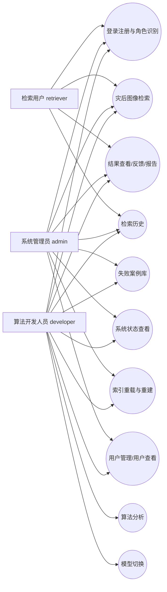
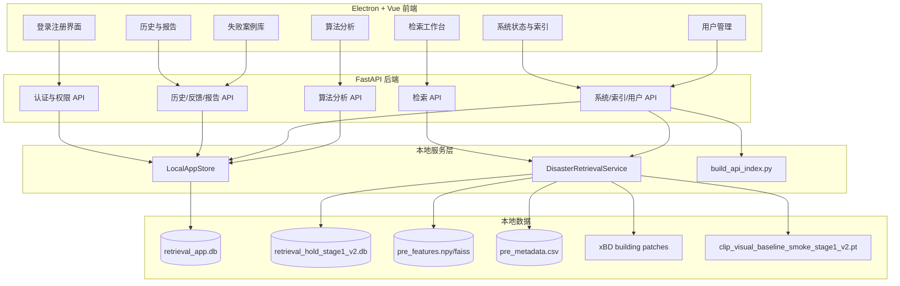
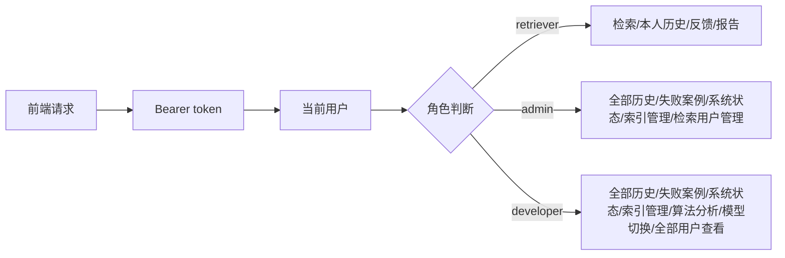
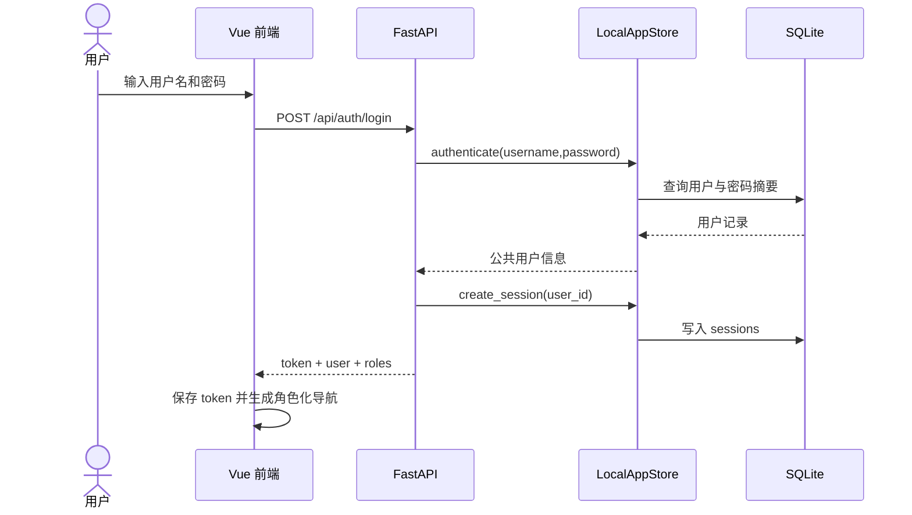
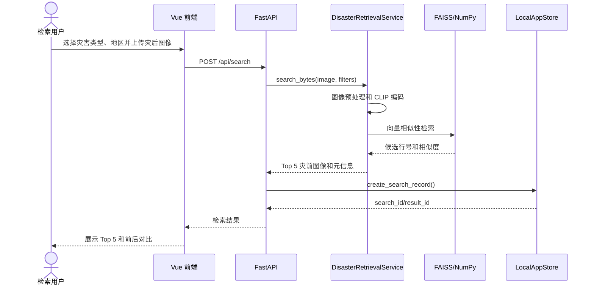
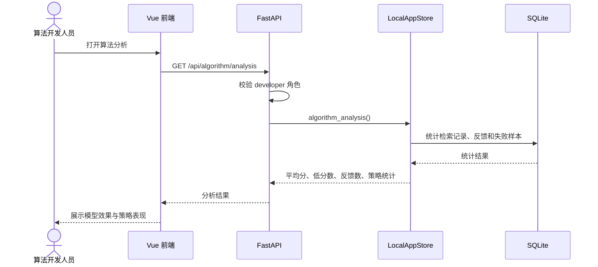
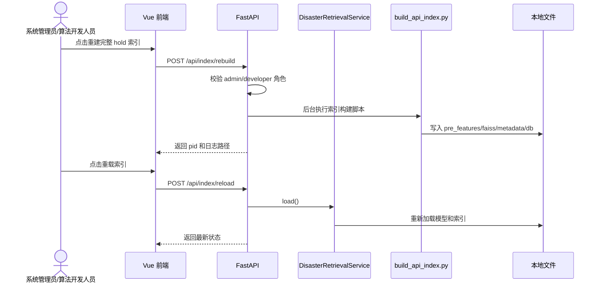

# 软件工程图

本文档给出灾后图像检索系统的主要软件工程图。系统服务于灾情研判场景，但权限模型只设置三类系统角色：检索用户 `retriever`、系统管理员 `admin`、算法开发人员 `developer`。

## 1. 总体用例图

说明：

- 检索用户负责业务使用，完成灾后图像检索、结果查看、反馈和报告导出。
- 系统管理员负责系统运行维护，包括检索用户增删改查、系统状态、索引重载和索引重建；管理员不查看 developer 用户信息。
- 算法开发人员负责模型效果分析，包括失败案例、算法分析、模型切换和检索策略调试，并可查看全部用户信息。

## 2. 模块结构图

## 3. 权限控制图

核心规则：

- `/api/users` 允许 `admin` 和 `developer`，其中 `admin` 不返回 developer 用户，`developer` 返回全部用户。
- `/api/users` 的新增、修改和删除操作仅允许 `admin`，且只能操作 `retriever` 用户。
- `/api/failures`、`/api/system/status`、`/api/index/*` 允许 `admin` 和 `developer`。
- `/api/algorithm/analysis`、`/api/models` 和 `/api/models/switch` 仅允许 `developer`。
- `retriever` 只能查看本人历史，`admin` 和 `developer` 可以查看全部历史。

## 4. 登录注册时序图

## 5. 灾后图像检索时序图

## 6. 失败案例与算法分析时序图

## 7. 索引维护时序图

## 8. 模块与接口对应表

| 模块 | 前端入口 | 后端接口 | 主要数据 |
| --- | --- | --- | --- |
| 用户登录与角色识别 | 登录/注册界面 | `/api/auth/*` | `users`、`sessions` |
| 灾后图像检索 | 检索工作台 | `/api/search`、`/api/search-by-path` | 模型、FAISS、图库元信息 |
| 结果分析、反馈与报告 | 结果详情、历史报告 | `/api/results/*`、`/api/feedback`、`/api/history/*/report` | `search_results`、`feedback_records` |
| 检索历史与失败案例 | 历史、失败案例库 | `/api/history`、`/api/failures` | `search_records`、`feedback_records` |
| 系统状态、索引与用户管理 | 系统、用户管理 | `/api/system/status`、`/api/index/*`、`/api/users` | 索引文件、用户表 |
| 算法分析 | 算法分析、模型切换 | `/api/algorithm/analysis`、`/api/models`、`/api/models/switch` | 历史记录、反馈记录、失败案例、checkpoint |
