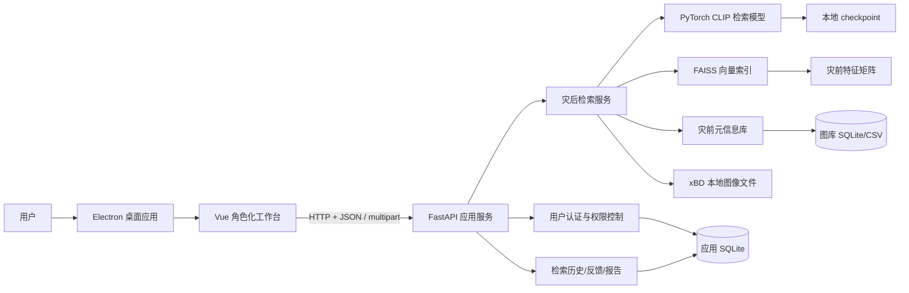

# 系统设计

## 1. 架构设计

### 1.1 总体架构

灾后检索系统采用本地离线部署架构，由桌面端交互层、应用服务层、检索算法层、本地数据层四部分组成。系统不依赖云端推理服务，模型、索引、图像数据、用户账号和检索历史均存储在本地。



系统中各层职责如下：

| 层次 | 组成 | 职责 |
| --- | --- | --- |
| 桌面端交互层 | Electron + Vue | 登录注册、角色化工作台、检索输入、结果展示、历史查看、报告导出 |
| 应用服务层 | FastAPI | 提供 REST API、用户鉴权、权限控制、业务数据读写、资源访问 |
| 检索算法层 | PyTorch + FAISS | 加载模型、编码查询图像、过滤候选库、执行向量检索、返回 Top-K |
| 本地数据层 | SQLite + CSV + NPY + FAISS + 图像文件 | 保存账号、会话、检索历史、反馈、灾前元信息、特征索引和 xBD 图像 |

### 1.2 离线部署架构

系统部署在单机环境中，后端监听本地地址 `127.0.0.1:8000`，前端通过 HTTP 调用本地 API。Electron 可作为桌面壳启动 Vue 页面，并尝试拉起 FastAPI 后端服务。

离线部署需要包含以下资源：

| 资源 | 说明 |
| --- | --- |
| Python 环境 | PyTorch、FastAPI、FAISS、Pandas、Pillow 等依赖 |
| Node/Electron 环境 | 前端开发和桌面应用运行环境 |
| CLIP 预训练权重 | `pretrained/openai-clip-vit-base-patch32/` |
| 检索模型 checkpoint | `checkpoints/clip_visual_baseline_smoke_stage1_v2.pt` 或语义增强模型 |
| 灾前特征矩阵 | `indexes/.../pre_features.npy` |
| FAISS 索引 | `indexes/.../pre_features.faiss` |
| 元信息数据库 | `db/retrieval_hold_stage1_v2.db`、`db/retrieval_app.db` |
| xBD 图像文件 | `data/raw/` 和 `data/processed/` 下的影像与 patch |

### 1.3 请求处理流程

用户执行一次灾后图像检索时，系统的数据流如下：

1. 用户登录系统，前端保存本地会话 token。
2. 用户选择灾害类型、灾害地区、过滤模式和排序策略。
3. 用户上传灾后图像，或选择 hold 样例图像。
4. 前端调用 `/api/search` 或 `/api/search-by-path`。
5. 后端校验 token 和角色权限。
6. 检索服务加载查询图像，进行 CLIP 预处理和特征编码。
7. 后端根据过滤模式筛选灾前候选库。
8. FAISS 对候选灾前特征执行余弦相似度检索。
9. 系统按聚合策略得到 tile 或 patch 排名，返回 Top 5。
10. 后端写入检索历史和结果明细。
11. 前端展示 Top 5 灾前图像、相似度和元信息。

## 2. 数据库设计

系统数据设计分为四类：用户认证数据、检索业务数据、灾前图库元信息、向量索引与文件资源。这样划分可以把系统业务数据和算法数据解耦，便于维护和扩展。

### 2.1 用户认证数据库

用户认证数据存储在 `db/retrieval_app.db` 中，用于本地登录、注册和角色控制。

#### 2.1.1 用户表 `users`

| 字段 | 类型 | 约束 | 说明 |
| --- | --- | --- | --- |
| id | INTEGER | PRIMARY KEY | 用户编号 |
| username | TEXT | UNIQUE NOT NULL | 登录用户名 |
| password_hash | TEXT | NOT NULL | PBKDF2 加密后的密码摘要 |
| salt | TEXT | NOT NULL | 密码盐值 |
| role | TEXT | NOT NULL | 用户角色 |
| display_name | TEXT | NOT NULL | 显示名称 |
| created_at | TEXT | NOT NULL | 创建时间 |
| last_login_at | TEXT |  | 最近登录时间 |

系统支持三类角色：

| 角色 | 权限定位 |
| --- | --- |
| `retriever` | 检索用户，完成灾后图像检索、结果查看、反馈标注和报告导出 |
| `admin` | 系统管理员，负责用户管理、系统状态查看、索引重载与重建 |
| `developer` | 算法开发人员，负责失败案例分析、模型效果评估和检索策略调试 |

#### 2.1.2 会话表 `sessions`

| 字段 | 类型 | 约束 | 说明 |
| --- | --- | --- | --- |
| token | TEXT | PRIMARY KEY | 本地会话 token |
| user_id | INTEGER | FOREIGN KEY | 对应用户 |
| created_at | TEXT | NOT NULL | 会话创建时间 |
| expires_at | TEXT | NOT NULL | 会话过期时间 |

用户登录成功后，后端生成 Bearer token。前端后续请求在 `Authorization` 请求头中携带 token，后端据此完成身份识别和权限控制。

### 2.2 检索业务数据库

检索业务数据同样保存在 `db/retrieval_app.db` 中，负责记录系统使用过程，支撑历史查看、报告导出、失败案例分析和用户反馈。

#### 2.2.1 检索记录表 `search_records`

| 字段 | 类型 | 说明 |
| --- | --- | --- |
| id | INTEGER | 检索记录编号 |
| user_id | INTEGER | 发起检索的用户 |
| query_time | TEXT | 检索时间 |
| query_kind | TEXT | 查询来源，如 upload、path、batch_upload |
| query_label | TEXT | 查询图像文件名或路径 |
| disaster_type | TEXT | 用户选择的灾害类型 |
| disaster | TEXT | 用户选择的灾害地区 |
| filter_mode | TEXT | 候选过滤模式 |
| aggregation | TEXT | 排序聚合策略 |
| top_k | INTEGER | 返回结果数量 |
| query_json | TEXT | 查询图像信息 JSON |
| gallery_json | TEXT | 候选图库信息 JSON |
| elapsed_ms | REAL | 检索耗时 |
| result_count | INTEGER | 返回结果数量 |
| top_score | REAL | Top 1 分数 |
| scope | TEXT | 当前索引范围 |

#### 2.2.2 检索结果表 `search_results`

| 字段 | 类型 | 说明 |
| --- | --- | --- |
| id | INTEGER | 检索结果编号 |
| search_id | INTEGER | 所属检索记录 |
| rank | INTEGER | 结果排名 |
| positive_id | TEXT | 建筑级正样本 ID |
| tile_id | TEXT | tile ID |
| score | REAL | 聚合相似度分数 |
| best_patch_score | REAL | 最佳 patch 分数 |
| disaster | TEXT | 命中图像所属灾害地区 |
| disaster_type | TEXT | 命中图像所属灾害类型 |
| damage_label | TEXT | 损毁标签 |
| pre_patch_path | TEXT | 灾前 patch 路径 |
| pre_patch_url | TEXT | 灾前 patch 资源 URL |
| paired_post_patch_path | TEXT | 配对灾后 patch 路径 |
| paired_post_patch_url | TEXT | 配对灾后 patch URL |
| result_json | TEXT | 完整结果 JSON |

#### 2.2.3 用户反馈表 `feedback_records`

| 字段 | 类型 | 说明 |
| --- | --- | --- |
| id | INTEGER | 反馈编号 |
| search_result_id | INTEGER | 对应检索结果 |
| user_id | INTEGER | 反馈用户 |
| feedback | TEXT | correct、wrong 或 uncertain |
| note | TEXT | 备注 |
| created_at | TEXT | 反馈时间 |

### 2.3 灾前图库元信息数据库

灾前图库元信息来源于 `data/processed/xbd_building_patches.csv`，系统构建检索库时会写入 `gallery_items` 表。

#### 2.3.1 图库元信息表 `gallery_items`

| 字段 | 类型 | 说明 |
| --- | --- | --- |
| positive_id | TEXT | 灾前/灾后建筑配对 ID |
| building_id | TEXT | 建筑 ID |
| building_uid | TEXT | 建筑实例 UID |
| tile_id | TEXT | xBD tile ID |
| pre_image_path | TEXT | 灾前原始 tile 图像路径 |
| post_image_path | TEXT | 灾后原始 tile 图像路径 |
| pre_patch_path | TEXT | 灾前建筑 patch 路径 |
| post_patch_path | TEXT | 灾后建筑 patch 路径 |
| disaster | TEXT | 灾害地区或灾害事件 |
| disaster_type | TEXT | 灾害类型 |
| damage_label | TEXT | 建筑损毁标签 |
| damage_id | INTEGER | 损毁标签编号 |
| split | TEXT | 数据集划分 |
| view | TEXT | 图像视角，灾前库为 pre |

该表主要用于将向量检索返回的索引位置转换为可解释的业务结果，包括图像路径、灾害信息和建筑标识。

### 2.4 向量索引与文件资源设计

向量特征和图像资源不直接存入 SQLite，而是以文件形式保存：

| 文件 | 说明 |
| --- | --- |
| `pre_features.npy` | 灾前图像特征矩阵 |
| `pre_features.faiss` | FAISS 向量索引 |
| `pre_metadata.csv` | 与特征矩阵行号对齐的元信息 |
| `data/processed/xbd_building_patches/` | 建筑级灾前/灾后 patch |
| `outputs/uploads/` | 用户上传图像缓存 |
| `outputs/logs/api_index_rebuild.log` | 后台索引重建日志 |

特征矩阵、FAISS 索引和元信息 CSV 通过行号对齐。检索时 FAISS 返回候选行号，系统再从元信息表中读取对应的 `positive_id`、`tile_id`、`pre_patch_path` 等信息。

## 3. 功能模块设计

功能模块设计与业务用例保持一致，不按照前端/后端技术分层划分，而是按照用户完成业务任务的过程划分。需求分析中设置五个核心用例，因此系统设计对应五个功能模块。

| 需求分析用例 | 系统设计功能模块 |
| --- | --- |
| 用户登录与角色识别 | 用户登录与角色识别模块 |
| 单张灾后图像检索 | 灾后图像检索模块 |
| 检索结果分析、反馈与报告导出 | 结果分析、反馈与报告模块 |
| 检索历史与失败案例管理 | 检索历史与失败案例模块 |
| 系统状态、索引与用户管理 | 系统状态、索引与用户管理模块 |

### 3.1 用户登录与角色识别模块

对应业务用例：用户登录与角色识别。

模块职责：

- 提供注册、登录、退出和会话恢复。
- 保存本地用户账号和角色信息。
- 根据角色控制可访问功能。
- 防止检索用户访问管理接口。

输入：

- 用户名、密码。
- 注册时的用户名、密码和角色。注册界面提供 `retriever`、`admin`、`developer` 三类角色下拉选择。

输出：

- 会话 token。
- 当前用户信息。
- 可访问的角色化工作台。

核心接口：

| 接口 | 说明 |
| --- | --- |
| `POST /api/auth/register` | 注册本地用户 |
| `POST /api/auth/login` | 登录并生成 token |
| `GET /api/auth/me` | 恢复当前会话 |
| `POST /api/auth/logout` | 退出登录 |
| `GET /api/users` | 用户查询，管理员不可查看 developer，developer 可查看全部用户 |
| `POST /api/users` | 新增检索用户，限系统管理员 |
| `PATCH /api/users/{user_id}` | 修改检索用户信息，限系统管理员 |
| `DELETE /api/users/{user_id}` | 删除或停用检索用户，限系统管理员 |
| `GET /api/algorithm/analysis` | 模型效果和检索策略分析，限算法开发人员 |
| `GET /api/models` | 查看可切换模型，限算法开发人员 |
| `POST /api/models/switch` | 切换模型 checkpoint，限算法开发人员 |

权限设计：

| 功能 | retriever | admin | developer |
| --- | --- | --- | --- |
| 图像检索 | 支持 | 支持 | 支持 |
| 查看检索结果 | 支持 | 支持 | 支持 |
| 查看本人历史 | 支持 | 支持 | 支持 |
| 查看全部历史 | 不支持 | 支持 | 支持 |
| 导出检索报告 | 支持 | 支持 | 支持 |
| 提交结果反馈 | 支持 | 支持 | 支持 |
| 查看失败案例 | 不支持 | 可查看 | 支持 |
| 用户管理 | 不支持 | 管理检索用户，不可查看 developer | 查看全部用户 |
| 系统状态查看 | 不支持 | 支持 | 支持 |
| 索引重载与重建 | 不支持 | 支持 | 支持 |
| 模型效果分析 | 不支持 | 不支持 | 支持 |
| 检索策略调试 | 不支持 | 不支持 | 支持 |
| 模型切换 | 不支持 | 不支持 | 支持 |
| 历史数据 Markdown 导出包 | 支持本人记录 | 支持全部记录 | 支持全部记录 |
| 失败案例 Markdown 导出包 | 不支持 | 支持 | 支持 |

### 3.2 灾后图像检索模块

对应业务用例：单张灾后图像检索。

模块职责：

- 支持上传灾后图像。
- 支持选择 hold 样例灾后图像。
- 支持多图批量检索。
- 支持灾害类型、灾害地区、过滤模式和聚合策略设置。
- 调用检索模型返回 Top 5 灾前图像。

输入：

- 灾后图像文件或后端已有图像路径。
- `disaster_type`。
- `disaster`。
- `filter_mode`：`both`、`type`、`disaster`、`none`。
- `aggregation`：`top_m`、`max`、`mean`、`sum`、`vote`。

输出：

- Top 5 灾前图像。
- 相似度分数。
- 检索耗时。
- 候选 patch 数和候选 tile 数。
- 图像路径、建筑 ID、tile ID、损毁标签等元信息。

核心接口：

| 接口 | 说明 |
| --- | --- |
| `GET /api/options` | 获取可选灾害类型和地区 |
| `GET /api/samples` | 获取 hold 样例图像 |
| `POST /api/search` | 上传单张图像检索 |
| `POST /api/search-by-path` | 使用已有图像路径检索 |
| `POST /api/batch-search` | 批量上传检索 |
| `POST /api/batch-search-by-path` | 批量路径检索 |

### 3.3 结果分析、反馈与报告模块

对应业务用例：检索结果分析、反馈与报告导出。

模块职责：

- 展示检索结果详情。
- 提供灾后查询图像和灾前命中图像的对比视图。
- 保存检索历史。
- 保存用户反馈。
- 生成 Markdown 检索报告。
- 汇总失败案例。

输入：

- 检索结果 ID。
- 用户反馈：correct、wrong、uncertain。
- 反馈备注。

输出：

- 历史记录列表。
- 单次检索详情。
- Markdown 报告。
- 失败案例列表。

核心接口：

| 接口 | 说明 |
| --- | --- |
| `GET /api/history` | 获取检索历史 |
| `GET /api/history/{search_id}` | 获取一次检索详情 |
| `GET /api/history/{search_id}/report` | 导出 Markdown 报告 |
| `GET /api/results/{result_id}` | 获取单个结果详情 |
| `POST /api/feedback` | 提交结果反馈 |
| `GET /api/failures` | 获取失败案例 |

### 3.4 检索历史与失败案例模块

对应业务用例：检索历史与失败案例管理。

模块职责：

- 保存每次检索的查询条件、用户、耗时和结果。
- 支持检索用户查看本人历史。
- 支持管理员和算法开发人员查看全部历史。
- 支持从历史记录中恢复检索结果。
- 汇总低分检索记录和错误反馈，形成失败案例库，并支持在失败案例复核弹窗中查看灾后查询图像与灾前候选图像。

输入：

- 当前登录用户。
- 历史记录 ID。
- 失败案例分数阈值。

输出：

- 检索历史列表。
- 单次历史详情。
- 失败案例列表。

核心接口：

| 接口 | 说明 |
| --- | --- |
| `GET /api/history` | 获取检索历史 |
| `GET /api/history/{search_id}` | 获取一次检索详情 |
| `GET /api/failures` | 获取失败案例 |

### 3.5 系统状态、索引与用户管理模块

对应业务用例：系统状态、索引与用户管理。

模块职责：

- 查看当前模型、设备、索引和本地资源状态。
- 显示 checkpoint、特征矩阵、元信息 CSV 和 SQLite 是否存在。
- 支持重载模型和索引。
- 支持后台重建完整 hold 灾前索引。
- 支持系统管理员按用户名检索 retriever 用户，并进行新增、查看、修改和删除，且不展示 developer 用户信息。
- 支持算法开发人员查看全部用户信息、模型效果、失败样本、检索策略统计和模型切换。

输入：

- 管理员或算法开发人员操作指令。
- 索引重建参数，如 split 和是否启用 AMP。

输出：

- 系统状态。
- 索引文件状态。
- 后台任务状态、进程号和日志路径。
- 用户列表和角色信息。
- 模型效果与检索策略统计。
- 历史记录 Markdown 导出包和失败案例 Markdown 导出包。

核心接口：

| 接口 | 说明 |
| --- | --- |
| `GET /api/system/status` | 查看系统状态 |
| `GET /api/index/status` | 查看索引状态 |
| `POST /api/index/reload` | 重载模型和索引 |
| `POST /api/index/rebuild` | 后台重建索引 |
| `GET /api/users` | 查看用户列表，admin 隐藏 developer，developer 可查看全部 |
| `POST /api/users` | 新增检索用户，限系统管理员 |
| `PATCH /api/users/{user_id}` | 修改检索用户信息，限系统管理员 |
| `DELETE /api/users/{user_id}` | 删除或停用检索用户，限系统管理员 |
| `GET /api/algorithm/analysis` | 查看模型效果和检索策略统计，限算法开发人员 |
| `GET /api/models` | 查看本地 checkpoint 列表，限算法开发人员 |
| `POST /api/models/switch` | 切换当前检索模型，限算法开发人员 |
| `GET /api/history/export` | 导出历史记录 Markdown 压缩包，内含报告和对应图像 |
| `GET /api/failures/export` | 导出失败案例 Markdown 压缩包，内含报告和对应图像 |

## 4. 算法设计

### 4.1 算法任务定义

算法任务是建筑级跨时相图像检索。给定灾后建筑图像或灾后图像 patch，系统需要在灾前图像库中找到对应或最相似的灾前建筑图像。

形式化表示为：

```text
Query:  灾后图像 q_post
Gallery: 灾前图像集合 G_pre = {g_1, g_2, ..., g_n}
Output: Top-K 灾前图像列表 R = {r_1, r_2, ..., r_k}
```

模型学习目标是使同一建筑的灾后图像特征与灾前图像特征在向量空间中更接近，使不同建筑样本的特征距离更远。

### 4.2 阶段划分

本项目算法设计分为两个阶段：

| 阶段 | 名称 | 输入 | 特点 | 定位 |
| --- | --- | --- | --- | --- |
| Stage-1 | 纯图像视觉检索 | 灾前图像、灾后图像 | 只使用视觉特征，不引入文本 | 当前稳定基线和系统默认部署模型 |
| Stage-2 | 文本语义增强检索 | 灾前图像、灾后图像、灾害文本语义 | 在 Stage-1 视觉空间基础上融合灾害类型和损毁语义 | 最终模型方向 |

需要明确的是，纯图像检索是 Stage-1 基线；在此基础上引入文本语义条件，才是最终的语义增强检索模型。当前系统按照“`clip_visual_baseline_smoke_stage1_v2.pt` 是最佳稳定模型”的前提进行部署，同时代码中已经实现 Stage-2 语义增强模型训练链路，用于后续替换和扩展。

### 4.3 原始数据集处理

#### 4.3.1 xBD 原始数据筛选

xBD 原始数据包含灾前遥感影像、灾后遥感影像和建筑标注文件。项目首先在 tile 级别构建元信息表，保留样本量较大的三类灾害：

- `fire`
- `flooding`
- `wind`

处理脚本：

```text
scripts/build_metadata.py
```

输出：

```text
data/processed/xbd_tile_dataset.csv
```

tile 元信息包括：

- `tile_id`
- `pre_image_path`
- `post_image_path`
- `pre_label_path`
- `post_label_path`
- `disaster`
- `disaster_type`
- `split`
- 建筑数量与损毁统计

#### 4.3.2 建筑级 patch 构建

由于系统目标是建筑级灾前检索，而不是整幅遥感图像检索，因此需要将 tile 级图像裁剪为建筑级 patch。处理脚本为：

```text
scripts/build_building_patches.py
```

输出：

```text
data/processed/xbd_building_patches.csv
data/processed/xbd_building_patches/
```

裁剪策略如下：

1. 根据 `uid` 对齐灾前和灾后同一建筑实例。
2. 读取灾前和灾后标注中的建筑多边形。
3. 使用灾前框和灾后框的并集作为裁剪区域。
4. 在裁剪区域外扩 16 像素上下文。
5. 将 patch resize 到 `224 x 224`，与 CLIP 输入尺寸一致。
6. 默认过滤 `un-classified` 损毁标签。

构建后的完整 building patch 数据规模为：

| 项目 | 数量 |
| --- | ---: |
| 总记录数 | 286,791 |
| hold | 33,499 |
| test | 30,006 |
| tier1 | 95,923 |
| tier3 | 127,363 |
| fire | 74,760 |
| flooding | 103,107 |
| wind | 108,924 |

损毁标签分布为：

| 损毁标签 | 数量 |
| --- | ---: |
| no-damage | 198,067 |
| minor-damage | 36,563 |
| major-damage | 28,523 |
| destroyed | 23,638 |

### 4.4 smoke 预处理

完整数据规模较大，直接用于早期模型训练和系统联调成本较高。项目设计了具有代表性的 smoke 子集，而不是简单随机抽样。

处理脚本：

```text
scripts/build_smoke_subset.py
```

输出：

```text
data/processed/xbd_building_patches_smoke_stage1.csv
```

smoke 子集构建原则：

1. 训练 split 使用 `tier3`，验证 split 使用 `hold`。
2. 按 `disaster_type + damage_label` 分组轮转采样。
3. 限制单个 tile 的最大样本数，避免少数大 tile 主导分布。
4. 保留多个灾害事件来源，避免样本过于集中。
5. 平衡三类灾害和四类损毁标签。

smoke 子集统计如下：

| 项目 | 数量 |
| --- | ---: |
| 来源完整记录 | 286,791 |
| smoke 总样本 | 5,120 |
| tier3 训练样本 | 4,096 |
| hold 验证样本 | 1,024 |
| 唯一 tile | 2,055 |
| 灾害事件 | 14 |

按灾害类型分布：

| 灾害类型 | 数量 |
| --- | ---: |
| fire | 1,644 |
| flooding | 1,732 |
| wind | 1,744 |

按损毁标签分布：

| 损毁标签 | 数量 |
| --- | ---: |
| destroyed | 1,295 |
| major-damage | 1,256 |
| minor-damage | 1,258 |
| no-damage | 1,311 |

### 4.5 Stage-1 纯图像检索模型设计

#### 4.5.1 模型结构

Stage-1 模型使用本地 CLIP ViT-B/32 视觉编码器作为骨干网络，结构如下：

```text
灾前图像 patch -> CLIP Vision Encoder -> Projection Head -> L2 normalize -> 灾前向量
灾后图像 patch -> CLIP Vision Encoder -> Projection Head -> L2 normalize -> 灾后向量
```

模型实现：

```text
src/models/clip_visual_encoder.py
```

主要设计：

- 使用 `pretrained/openai-clip-vit-base-patch32` 本地权重。
- 默认冻结 CLIP vision backbone，降低训练成本。
- 增加 projection head，将 CLIP hidden size 映射到 256 维检索向量。
- 对输出向量进行 L2 归一化，便于使用余弦相似度检索。

#### 4.5.2 损失函数

Stage-1 使用对称 InfoNCE 损失。一个 batch 中，第 `i` 张灾后图像与第 `i` 张灾前图像构成正样本，其余样本作为 in-batch negatives。

相似度矩阵为：

```text
S = Q_post * K_pre^T / temperature
```

损失函数为：

```text
L = 0.5 * CE(S, label) + 0.5 * CE(S^T, label)
```

其中 `label = [0, 1, ..., B-1]`。该设计同时约束“灾后查灾前”和“灾前查灾后”两个方向，使跨时相特征空间更加稳定。

#### 4.5.3 检索方式

训练完成后，系统对 hold 灾前图像提取特征，构建 FAISS 索引：

```text
灾前 patch -> Stage-1 Encoder -> pre_features.npy -> FAISS IndexFlatIP
```

查询时：

```text
灾后图像 -> Stage-1 Encoder -> query vector -> FAISS search -> Top-K 灾前结果
```

由于向量已经归一化，FAISS 使用内积等价于余弦相似度。

### 4.6 Stage-2 文本语义增强模型设计

Stage-2 在 Stage-1 纯图像模型基础上引入文本语义，目标是利用灾害类型和损毁标签增强灾后查询侧表示。

#### 4.6.1 语义输入

语义字段包括：

- `disaster_type`
- `damage_label`

文本模板为：

```text
a post-disaster satellite image of a {damage_label} building after a {disaster_type} disaster
```

示例：

```text
a post-disaster satellite image of a destroyed building after a fire disaster
```

#### 4.6.2 模型结构

Stage-2 模型在 Stage-1 图像编码器基础上增加 CLIP text encoder 和语义融合模块：

```text
灾后图像 -> 图像编码器 -> post image embedding
灾害文本 -> 文本编码器 -> text embedding
post image embedding + text embedding -> query fusion -> semantic query embedding
灾前图像 -> 图像编码器 -> pre gallery embedding
```

融合方式使用 `residual_gate`：

```text
query = image_embedding + sigmoid(gate) * Linear(text_embedding)
```

最终对 query 做归一化，再与灾前 gallery embedding 执行检索。

#### 4.6.3 训练目标

Stage-2 包含三类目标：

| 目标 | 说明 |
| --- | --- |
| query-to-gallery loss | 语义增强后的灾后 query 对齐灾前 gallery |
| semantic alignment loss | 灾后图像特征对齐对应语义文本 |
| visual auxiliary loss | 保持纯图像跨时相对齐能力，可作为辅助项 |

在当前 v5 配置中：

- 使用 Stage-1 checkpoint 初始化视觉分支。
- 冻结 image projection。
- `semantic_loss_weight = 0.05`。
- `visual_loss_weight = 0.0`。
- `detach_gallery_for_query_loss = true`。
- 选择 `macro_recall@1` 作为 checkpoint 选择指标。

### 4.7 参数选取

#### 4.7.1 Stage-1 参数

| 参数 | 取值 |
| --- | --- |
| 训练数据 | `xbd_building_patches_smoke_stage1.csv` |
| train split | `tier3` |
| eval split | `hold` |
| image size | 224 |
| embedding dim | 256 |
| batch size | 32 |
| epochs | 12 |
| learning rate | 0.0001 |
| weight decay | 0.0001 |
| temperature | 0.07 |
| optimizer | AdamW |
| scheduler | CosineAnnealingLR |
| AMP | true |
| backbone | frozen CLIP vision backbone |
| sampling | disaster-type balanced sampling |
| loss weighting | inverse frequency |
| selection metric | macro_recall@1 |

参数选择依据：

- `224 x 224` 与 CLIP 输入尺寸一致，也与 building patch 输出尺寸一致。
- 256 维 embedding 在表达能力和索引存储成本之间取得平衡。
- 温度系数 0.07 是 CLIP/InfoNCE 常用设置。
- 选择 `macro_recall@1` 而不是 overall recall，是为了避免样本量较大的灾害类别主导模型选择。
- balanced sampling 和 inverse-frequency weighting 用于缓解灾害类别和损毁标签不均衡问题。

#### 4.7.2 Stage-2 参数

| 参数 | 取值 |
| --- | --- |
| init visual checkpoint | Stage-1 visual checkpoint |
| batch size | 16 |
| epochs | 6 |
| learning rate | 0.0001 |
| semantic temperature | 0.07 |
| semantic loss weight | 0.05 |
| visual loss weight | 0.0 |
| query fusion | residual_gate |
| semantic fields | disaster_type, damage_label |
| text template | post-disaster building + damage + disaster |
| freeze image projection | true |
| detach gallery | true |
| selection metric | macro_recall@1 |

Stage-2 batch size 较小，是因为同时加载图像编码器和文本编码器，显存占用高于 Stage-1。语义损失权重设置为 0.05，是为了让文本语义起到轻量引导作用，避免破坏 Stage-1 已学习到的视觉匹配空间。

### 4.8 主体实验设计

主体实验以 smoke 数据集为开发闭环，验证模型是否能够完成建筑级灾后到灾前检索。

#### 4.8.1 评价指标

使用以下指标：

| 指标 | 说明 |
| --- | --- |
| Recall@1 | Top 1 是否命中正确建筑 |
| Recall@5 | Top 5 是否包含正确建筑 |
| Recall@10 | Top 10 是否包含正确建筑 |
| MRR | 正确结果排名倒数的平均值 |
| macro_by_disaster_type | 按灾害类型分组后取宏平均 |
| macro_by_damage_label | 按损毁标签分组后取宏平均 |

#### 4.8.2 Stage-1 主体实验结果

Stage-1 v2 是当前部署的纯图像最佳稳定模型：

| 模型 | Recall@1 | Recall@5 | Recall@10 | MRR |
| --- | ---: | ---: | ---: | ---: |
| Stage-1 visual v2 | 0.3115 | 0.5322 | 0.6240 | 0.4040 |

按灾害类型的最佳验证结果：

| 灾害类型 | Recall@1 | Recall@5 | Recall@10 | MRR |
| --- | ---: | ---: | ---: | ---: |
| fire | 0.3750 | 0.5956 | 0.6654 | 0.4628 |
| flooding | 0.2899 | 0.5160 | 0.6117 | 0.3862 |
| wind | 0.2872 | 0.5000 | 0.6037 | 0.3781 |

tile 级聚合检索结果如下：

| 模型 | Recall@1 | Recall@5 | Recall@10 | MRR |
| --- | ---: | ---: | ---: | ---: |
| Stage-1 visual v2 tile aggregation | 0.3091 | 0.5432 | 0.7023 | 0.4136 |

#### 4.8.3 灾害先验过滤实验

系统应用侧允许用户输入 `disaster_type` 和 `disaster`。在实验中，使用 `disaster` 作为候选库先验过滤条件后，patch 级检索结果明显提升：

| 设置 | Recall@1 | Recall@5 | Recall@10 | MRR |
| --- | ---: | ---: | ---: | ---: |
| 不使用灾害地区先验 | 0.3115 | 0.5322 | 0.6240 | 0.4040 |
| 使用 disaster 先验过滤 | 0.4541 | 0.7275 | 0.8389 | 0.5710 |

这说明用户输入灾害地区具有明确业务价值，可以减少候选库噪声，提高检索准确率。

### 4.9 消融实验设计

消融实验用于分析各个设计因素对检索性能的影响。

#### 4.9.1 Stage-1 训练策略消融

| 实验 | Recall@1 | Recall@5 | Recall@10 | MRR | 说明 |
| --- | ---: | ---: | ---: | ---: | --- |
| Stage-1 visual | 0.2900 | 0.5010 | 0.6221 | 0.3821 | 初始纯图像基线 |
| Stage-1 visual v2 | 0.3115 | 0.5322 | 0.6240 | 0.4040 | 延长训练、增大有效负样本、类别平衡和宏平均选择 |

结果说明：v2 相比初始 Stage-1 在 Recall@1、Recall@5 和 MRR 上均有提升，因此作为系统默认部署模型更合适。

#### 4.9.2 文本语义增强消融

| 实验 | Recall@1 | Recall@5 | Recall@10 | MRR | 说明 |
| --- | ---: | ---: | ---: | ---: | --- |
| Stage-2 semantic v1 | 0.1250 | 0.3203 | 0.4355 | 0.2078 | 直接语义训练，破坏视觉检索空间 |
| Stage-2 semantic v2 | 0.2754 | 0.4795 | 0.6016 | 0.3656 | 调整语义训练后恢复部分效果 |
| Stage-2 semantic v3 | 0.2637 | 0.4941 | 0.5986 | 0.3624 | 进一步语义配置尝试 |
| Stage-2 semantic v4 stage1-init | 0.2900 | 0.5010 | 0.6221 | 0.3821 | 使用 Stage-1 初始化，保持视觉空间 |
| Stage-2 semantic v5 type+damage | 0.2930 | 0.5039 | 0.6152 | 0.3842 | 引入灾害类型和损毁标签文本 |

结果说明：

1. 直接引入文本语义可能导致视觉检索空间退化。
2. 使用 Stage-1 初始化能够显著稳定 Stage-2。
3. 文本语义增强是最终模型方向，但需要在不破坏视觉匹配能力的前提下进行。
4. 当前系统部署仍以 Stage-1 visual v2 作为最佳稳定模型，Stage-2 作为语义增强实验链路保留。

#### 4.9.3 候选过滤策略消融

候选过滤策略对应系统应用中的 `filter_mode`：

| 模式 | 说明 | 预期影响 |
| --- | --- | --- |
| `none` | 不使用用户输入过滤，全库检索 | 候选最多，召回难度最大 |
| `type` | 仅按灾害类型过滤 | 去除其他灾害类型噪声 |
| `disaster` | 仅按灾害地区过滤 | 大幅减少候选空间，提升精度 |
| `both` | 同时按灾害类型和地区过滤 | 最符合业务输入假设 |

实验结果表明，使用灾害地区先验过滤后 Recall@5 从 0.5322 提升到 0.7275，说明业务条件输入与算法检索是互补关系。

#### 4.9.4 聚合策略消融

对于整幅图像或多 patch 查询，系统支持以下聚合策略：

| 策略 | 说明 |
| --- | --- |
| `max` | 使用单个最高 patch 分数 |
| `mean` | 使用全部命中分数均值 |
| `sum` | 使用全部命中分数求和 |
| `vote` | 使用命中次数作为分数 |
| `top_m` | 使用最高的 m 个 patch 分数均值 |

系统默认采用 `top_m`，因为它在稳定性和鲁棒性之间较为均衡：相比 `max` 不容易被单个偶然高分影响，相比 `sum` 不容易偏向 patch 数量更多的 tile。

## 5. 本章小结

本章完成了灾后检索系统的系统设计。首先给出了系统的整体架构，明确系统采用本地离线部署方式，由 Electron/Vue 桌面端、FastAPI 服务、PyTorch/FAISS 检索算法和 SQLite 本地数据库共同组成。随后从用户认证、检索业务、图库元信息、向量索引四个方面完成数据库设计。

在功能模块设计部分，本章按照业务用例划分系统功能，而不是简单按照前后端技术结构划分，分别设计了用户登录与角色识别模块、灾后图像检索模块、结果分析反馈与报告模块、检索历史与失败案例模块、系统状态索引与用户管理模块。

在算法设计部分，本章详细说明了 xBD 原始数据处理、building patch 构建、smoke 子集预处理、Stage-1 纯图像检索模型、Stage-2 文本语义增强模型、参数选取、主体实验和消融实验。需要强调的是，Stage-1 是纯图像检索基线，当前系统部署使用的 `clip_visual_baseline_smoke_stage1_v2.pt` 属于该阶段；在 Stage-1 基础上引入灾害类型和损毁标签文本语义后，才构成最终语义增强检索模型方向。
